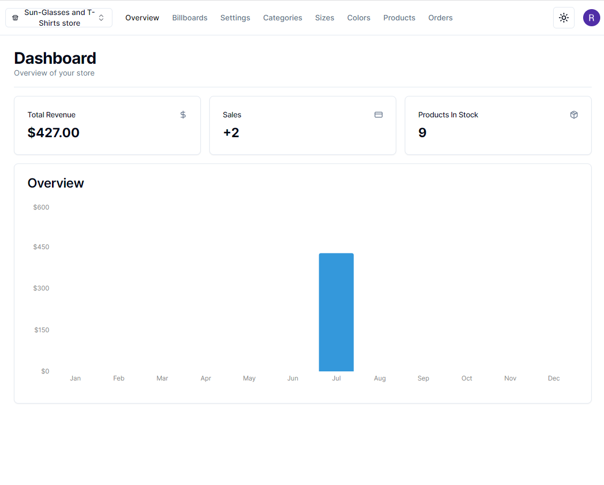
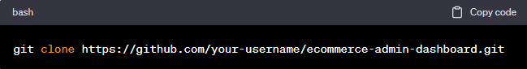
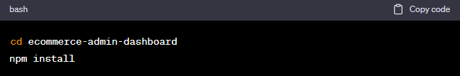
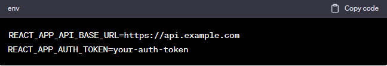
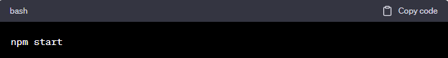

<h1>Ecommerce Admin Dashboard</h1>
<h3>Welcome to the Ecommerce Admin Dashboard! This is the admin interface for managing products, orders, and other aspects of the Ecommerce Store.</h3>

<h2>Live Demo</h2>
Check out the live demo of the Ecommerce Store:  <a href=https://ecommerce-admin-phi-seven.vercel.app target="_blank"> Ecommerce Admin Dashboard Live Demo. 

<h2>Features</h2>
<b>Admin Login:</b> Securely log in to the admin dashboard. 
<b>Product Management:</b> Add, edit, and delete products available in the store. 
<b>Order Management:</b> View and manage customer orders and update their statuses. 
<b>Category Management:</b> Manage product categories and assign products to relevant categories. 
<b>User Management:</b> View and manage user accounts and permissions. 
<b>Analytics:</b> Access various reports and analytics to gain insights into store performance.

<h2>Tech Stack</h2>
The Ecommerce Admin Dashboard is built using the following <mark>technologies:</mark>: 
 

Frontend: <b>HTML, CSS, Tailwind CSS, React.js, TypeScript, Next.js, Headless UI, PostCSS</b>  
Backend: <b>Next.js, Stripe, Zustand, Axios, Recharts, Zod, Next Cloudinary, Next Themes</b>  
Database: <b>Prisma</b>  
Deployment: <b>Vercel</b>  

<h2>Getting Started </h2>
To run the project locally, follow these steps:

<h3>Clone the repository:</h3>
  

<h3>Install dependencies:</h3>
 

<h3>Set up environment variables:</h3>
Create a .env file in the root directory and add the necessary environment variables, such as:  

<h3>Start the development server:</h3>
  

Open your web browser and navigate to http://localhost:3000 to access the admin dashboard.
<h2>Contributing</h2>
We welcome contributions to improve the Ecommerce Admin Dashboard project. If you find any bugs, have feature requests, or want to contribute in any other way, please open an issue or submit a pull request.
